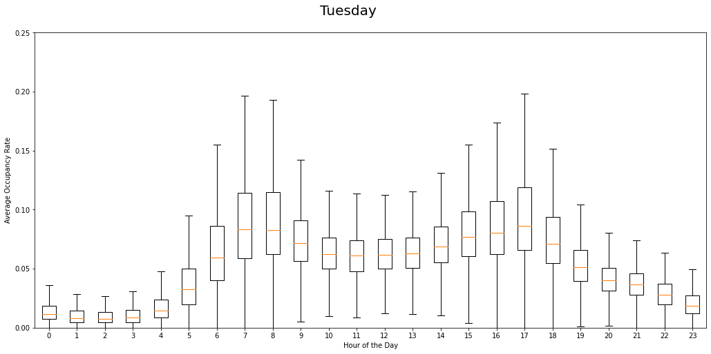
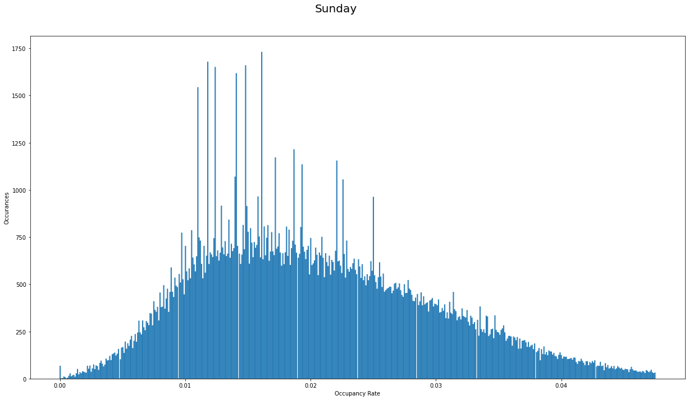
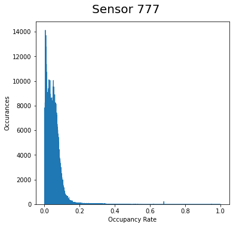

# SJSU_CMPE-255_Grp12
CMPE-255 Project Group 12 - Traffic Patterns

## Members
* Karl Gendler
* Ben Hochstadt

## Project Discription
This project looks at a set of data from the CalTrans PEMS repository of traffic density of San Francisco Bay Area freeways.
This data was compiled by Dr. Cuturi of UCI. (https://archive.ics.uci.edu/ml/machine-learning-databases/00204/)
The goal was to train various models on a subset of the data and compare their performance in predicting what day of the week it is.

## How to run the code
Using Python 3.8, run the .py file in this repository. It will simply run through the analysis. Note that the code must be in a directory where it has write access as it will download the data from the web as a .zip file and decompress the data. The project was originally done in Google Colaboratory; please let the authors know if access is required for additional grading. The link is included in the .py file. Note that when plots are opened, they must be closed before the code will continue to run.

## Useful analysis functions
The following functions were used to analyse portions of the dataset and display them in a way 
```python
boxplot_day(input, day_labels, day_to_plot, dt=6, average_flatten='flatten', show_outliers=False, dbg=False, show_averages=False)
boxplot_day(train_3D, labels, DAYS_str_to_label['Sunday'], average_flatten='flatten', show_outliers=False)
```
The boxplot function is an easy way to plot the overall behavior experienced during a particular day across the dataset.

```python
plot_bad_histogram(input, day_labels, day_to_plot, dt=6, idx=0, show_outliers=False, step=True)
plot_bad_histogram(train_3D, labels, DAYS_str_to_label['Sunday'], step=True)
```
The histogram function performs a similar goal as the boxplot function, but was very good at showing trends seen at certain measurement values.


```python
plot_single_sensor_data(input, sensor_idx=0)
plot_single_sensor_data(train_3D, sensor_idx=777)
```
The single sensor function plots the same histogram function, however groups the data into particular sensors.


```python
plot_all_sensor_data(input, day_labels, num_sensors):
plot_all_sensor_data(train_3D, labels, num_sensors)
```
This was a simple function that created the same style of sensor histograms above, but looped through the entirety of the sensor array.
